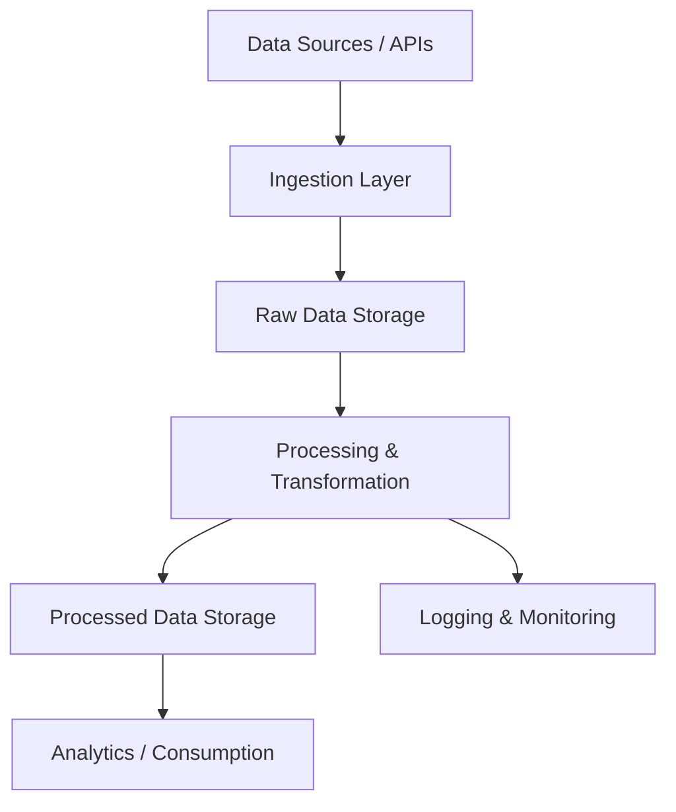
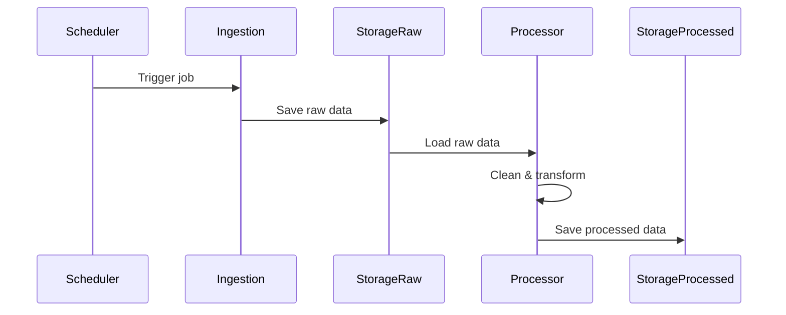
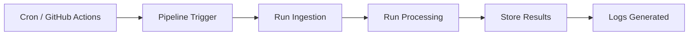
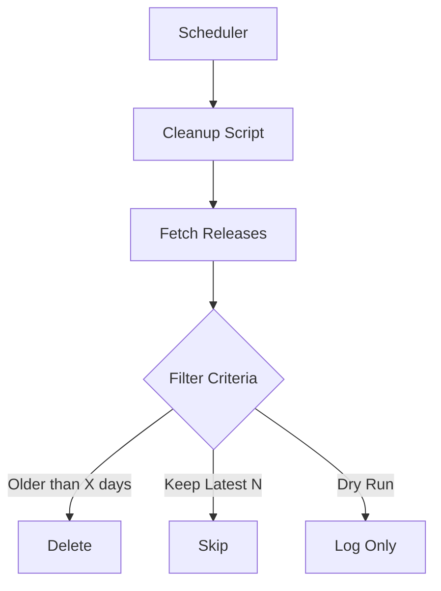

# 🏗️ Architecture Overview

This document describes the high-level architecture of the **MF Data Pipeline**, including data flow, components, and system design.

---

## 🔷 High-Level Architecture

---

## 🔑 Components

### 1. Data Sources
- External APIs
- Financial datasets
- Scheduled fetch jobs

### 2. Ingestion Layer (`scripts/`)
- Fetches raw mutual fund data
- Handles retries and failures
- Can be triggered manually or scheduled

### 3. Raw Data Storage (`data/raw/`)
- Stores unprocessed data
- Used for auditing and reprocessing

### 4. Processing Layer (`src/`)
- Cleans and validates data
- Transforms into structured format
- Handles business logic

### 5. Processed Storage (`data/processed/`)
- Clean datasets ready for analysis
- Optimized for querying and usage

### 6. Analytics / Consumption
- Reporting tools
- Dashboards (future scope)
- Data exports

### 7. Logging & Monitoring (`logs/`)
- Tracks pipeline runs
- Error logging
- Debugging support

---

## 🔄 Detailed Data Flow

---

## ⏰ Scheduling Architecture

---

## 🧹 Maintenance Architecture (Releases Cleanup)

---

## 📦 Tech Stack (Typical)

- Python
- Pandas / NumPy
- REST APIs
- Cron / GitHub Actions
- File-based or DB storage

---

## 🚀 Future Improvements

- Real-time streaming (Kafka / PubSub)
- Data validation layer
- Alerting system (Slack / Email)
- Dashboard integration
- Scalable storage (Data Warehouse)

---

> This architecture is designed to be modular, scalable, and easy to extend.
